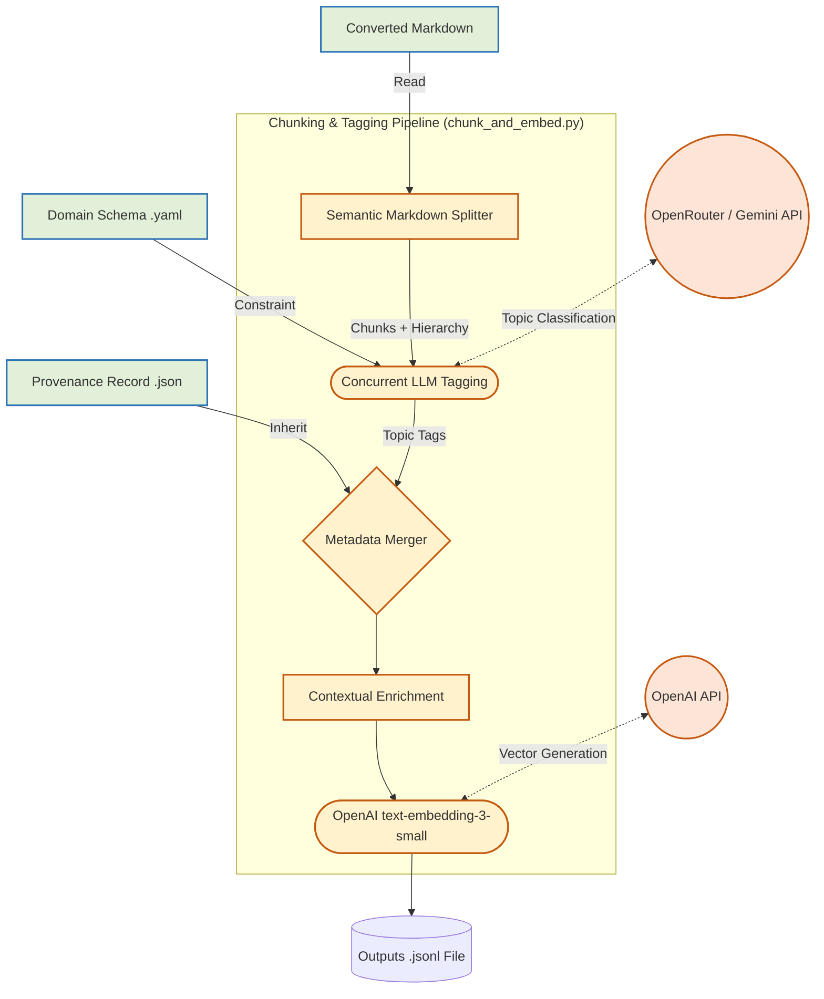

# DECISION-005: Clause-level Chunking & Tagging Pipeline

## 1. Context and Problem Statement
KnowledgeSlot acts as the content producer for Cosolvent's match engine. Currently, KnowledgeSlot converts raw documents (PDF, URL, CSV) into Markdown. However, raw Markdown is not searchable or commercially groundable in a vector database as-is. 

To bridge this gap, we require a pipeline that processes this Markdown into semantically coherent, metadata-tagged, and embedded JSON datasets ready for ingestion into Cosolvent's `reference_library` table (pgvector). 

## 2. Architectural Diagram

The pipeline implements best-practice RAG (Retrieval-Augmented Generation) patterns. 



## 3. Key Architecture Decisions

### 3.1 Semantic & Contextual Chunking
* **Decision:** We split text by Markdown headings (`#`, `##`, `###`) rather than fixed character counts.
* **Why:** Regulatory and contractual documents (like GAFTA contracts) are structured by clauses. Splitting mid-clause destroys semantic meaning.
* **Contextual Enrichment:** To prevent the "lost in the middle" problem during vector similarity search, the pipeline tracking the heading lineage (e.g., `13. PAYMENT > (b) Shipping documents`) and prepends it to the chunk text before generating the embedding.

### 3.2 Hierarchical Metadata Inheritance
* **Decision:** We divide metadata responsibilities into Document-level and Chunk-level.
* **Why:** Calling an LLM to determine the `jurisdiction` or `standard` for 500 individual chunks within a single document is wasteful and expensive.
  * **Inheritance:** `doc_type`, `standard`, and `jurisdiction` are inherited from the prior `metadata_extractor.py` step (loaded via `provenance.py`).
  * **Chunk-level Tagging:** The LLM is only used to classify the specific `topic` of the clause (e.g., `payment_terms`, `quality_requirements`), strictly constrained by the valid vocabulary inside the Domain Schema.

### 3.3 Streaming Output via JSONL
* **Decision:** The final output is written to `outputs/{document_stem}_processed.jsonl` (JSON Lines format).
* **Why:** Outputting a single massive JSON array can cause memory issues on the consumer side. JSONL allows Cosolvent's PostgreSQL/pgvector seed scripts to stream gigabytes of vectors linearly without blowing up application memory.

### 3.4 Concurrency & Resiliency
* **Decision:** Utilizes `asyncio.Semaphore` and the `tenacity` library.
* **Why:** Tagging every clause in a 50-page contract requires a high volume of requests to OpenRouter/OpenAI. Instead of deploying a heavy queue-broker like Celery, built-in asynchronous batching with exponential backoff elegantly prevents `429 Too Many Requests` API failures while keeping KnowledgeSlot fully self-contained.

## 4. Output Data Structure
The resulting `.jsonl` lines will match this schema precisely, ready for pgvector insertion:

```json
{
  "chunk_id": "27_2025_0",
  "content": "(b) Shipping documents shall consist of 1. Invoice...",
  "contextual_content": "[27_2025.md] 13. PAYMENT > (b) Shipping documents shall consist of...",
  "metadata": {
    "doc_type": "trade_contract",
    "standard": "GAFTA",
    "jurisdiction": ["Canada", "UK"],
    "topic": "payment_terms"
  },
  "embedding": [-0.0123, 0.0456, -0.0789, "... (1536 float array)"]
}
```