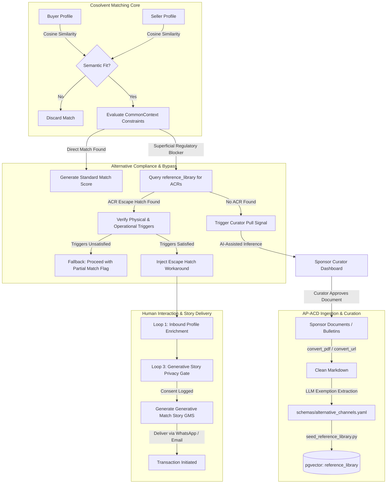

<!-- Copyright © 2026 Mustafa Uzumeri. All rights reserved. -->

# DECISION-006: Integrated Deal Matching and Alternative Compliance Discovery

> **Date:** 2026-05-26  
> **Context:** Architectural design specification integrating the Cosolvent Semantic Matching engine, the CommonContext industry-grounded knowledge layer, Alternative Compliance and Regulatory Escape Hatch Discovery (ACD), and the Generative Match Story (GMS).  
> **Status:** Active  
> **Author:** Antigravity Agent  

---

## Executive Summary

In thin industrial and specialty services markets, matching is not merely a problem of database indexing; it is a problem of **high-friction nuance and rigid regulatory barriers**. Buyers and sellers struggle to discover each other due to divergent vocabulary, and even when a potential match is found, transactions are frequently blocked by rigid standards and certification requirements (the "Rigid Wall" paradox). 

This design concept establishes a unified matching architecture. It integrates:
1. **Semantic Profile Matching** to capture qualitative nuance.
2. **CommonContext** to ground comparisons in domain-specific schemas.
3. **Alternative Compliance and Escape Hatch Discovery (ACD)** to automatically crawl, extract, and apply hidden regulatory exemptions, delegated roles, and equivalencies.
4. **The Generative Match Story (GMS)** as the operationalizing medium, translating complex, non-standard compliance workarounds into highly legible, step-by-step deal narratives that resolve the "first-contact" trust problem.

---

## Table of Contents

1. [The Three-Part Challenge of Thin Market Matching](#1-the-three-part-challenge-of-thin-market-matching)
2. [The Four Pillars of the Integrated Architecture](#2-the-four-pillars-of-the-integrated-architecture)
3. [The Unified Data & Process Flow](#3-the-unified-data--process-flow)
4. [The Generative Match Story as the Workaround Communicator](#4-the-generative-match-story-as-the-workaround-communicator)
5. [Anatomy of a Workaround Narrative: The Timmins Weld Test Case](#5-anatomy-of-a-workaround-narrative-the-timmins-weld-test-case)
6. [Human Feedback Loops and Interaction Channels](#6-human-feedback-loops-and-interaction-channels)
7. [Database Schema and Component Integration](#7-database-schema-and-component-integration)
8. [Closing the Testing Loop: Feeding ACD Triggers into ClientSynth](#8-closing-the-testing-loop-feeding-acd-triggers-into-clientsynth)

---

## 1. The Three-Part Challenge of Thin Market Matching

Bilateral thin markets exhibit three compounding barriers that traditional search and match directories cannot resolve:

```
┌─────────────────────────────────────────────────────────────────────────┐
│                           THE THIN MARKET GAP                           │
├───────────────────────────┬───────────────────────────┬─────────────────┤
│    1. Semantic Nuance     │      2. Rigid Walls       │ 3. First-Contact│
│         (Search)          │      (Compliance)         │     (Trust)     │
├───────────────────────────┼───────────────────────────┼─────────────────┤
│ Participants describe     │ Transactions freeze due   │ Complex, non-   │
│ capabilities/needs using  │ to high-cost, rigid       │ standard deals  │
│ non-standard, heterogeneous│ compliance rules (e.g.    │ stall because   │
│ professional language.    │ ISO 17025, UL 9540).      │ parties lack a  │
│ Keyword search fails.     │ Escape hatches are hidden.│ roadmap to trust│
└───────────────────────────┴───────────────────────────┴─────────────────┘
```

*   **The Nuance Barrier:** Traditional keyword directories fail because participants describe highly specific, complex capabilities and constraints using non-standardized phrasing. A local millwright and an industrial buyer are compatible in reality, but invisible to each other in standard index searches.
*   **The Rigid Wall Barrier:** Specialty markets are highly regulated. A viable transaction is frequently blocked by a standard certification or testing requirement that is temporally or financially out of reach for regional SMEs (e.g., shipping a single weld qualification coupon to an accredited lab 700 km away).
*   **The First-Contact Trust Barrier:** Even if a high-confidence match is identified, parties face a trust-deficit. Engaging in a non-standard deal requires professional risk, legal complexity, and steps neither party has navigated together before. Without a shared, concrete picture of execution, the deal remains uninitiated.

---

## 2. The Four Pillars of the Integrated Architecture

The proposed platform architecture resolves these barriers by combining four distinct technologies into an active transaction-facilitation pipeline:

```
                  ┌─────────────────────────────────────┐
                  │ 1. Semantic Profile Matching        │
                  │    - Nuance-aware profile vectors   │
                  └──────────────────┬──────────────────┘
                                     │ Passes candidates
                                     ▼
                  ┌─────────────────────────────────────┐
                  │ 2. CommonContext Schema             │
                  │    - Domain-grounded parameters     │
                  └──────────────────┬──────────────────┘
                                     │ Evaluates constraints
                                     ▼
                  ┌─────────────────────────────────────┐
                  │ 3. Alternative Channel Discovery   │
                  │    - Regulatory escape hatches      │
                  └──────────────────┬──────────────────┘
                                     │ Bypasses rigid walls
                                     ▼
                  ┌─────────────────────────────────────┐
                  │ 4. Generative Match Story (GMS)     │
                  │    - Concrete execution roadmap     │
                  └─────────────────────────────────────┘
```

### Pillar 1: Semantic Profile Matching
Rather than exact-match indexing, participant profiles are modeled as dynamic, schema-driven multi-dimensional vectors. The engine computes similarity across capabilities, materials, capacities, and requirements. It flags fits based on latent operational alignment, capturing fits that keyword engines ignore.

### Pillar 2: CommonContext (Sponsor-Curated Industry Grounding)
Raw semantic matching is commercially dangerous without vertical-specific grounding. **CommonContext** (formerly the Knowledge Slot) serves as a sponsor-curated reference library. It encodes regulatory thresholds, standard contract structures (e.g., GAFTA, CSA, UL), certifications, and logistics constraints. CommonContext pre-scopes the matching vocabulary and flags structural incompatibilities before the parties engage.

### Pillar 3: Alternative Compliance & Escape Hatch Discovery (ACD)
When CommonContext identifies a rigid regulatory constraint that blocks a match (e.g., *"testing lab must be accredited"*), the **Alternative Compliance Discovery (ACD)** engine is activated. 
Instead of failing the match, the engine searches its curated database of **Alternative Compliance Rules (ACRs)** (harvested via the automated AP-ACD crawling pipeline) for **Escape Hatch Archetypes**:
*   *Delegated Witnessing:* Allowing a certified human to witness and sign off on a process in an unaccredited facility.
*   *Risk-Tiered Scope Reduction:* Exempting technologies below a physical threshold (e.g., electrostatic vs. chemical storage).
*   *Equivalency:* Deeming standard compliance achieved via foreign or adjacent testing frameworks.
*   *Historical Performance Proof:* Utilizing historical calibration and metrology records (e.g., CMM data) in place of baseline testing.
*   *Sandbox/Grant Variances:* Applying regional public offsets or pilot programs.

### Pillar 4: The Generative Match Story (GMS)
The GMS is the **primary user interface and operationalizer of the regulatory escape hatch**. 
If a match requires an alternative compliance workaround, a dry PDF clause citation will not convince the parties to proceed. The GMS automatically synthesizes the profile attributes, the CommonContext standard rules, and the discovered escape hatch into a **personalized, step-by-step narrative**. It shows both parties exactly how their specific transaction can be physically and legally structured, transforming a complex compliance bypass into a clear, risk-mitigated business plan.

---

## 3. The Unified Data & Process Flow

The diagram below details the operational sequence from raw crawl to match generation, emphasizing the interactive human-feedback loops.



---

## 4. The Generative Match Story as the Workaround Communicator

The Generative Match Story is not static prose; it is a **dynamic transaction layout tool**. When an alternative compliance channel is utilized, the GMS structure shifts from a generic commercial summary to a **structured workaround guide**. 

Every ACD-enabled Generative Match Story is compiled into four logical parts:

```
┌─────────────────────────────────────────────────────────────────────────┐
│                      GMS WORKAROUND STORY STRUCTURE                     │
├─────────────────────────────────────────────────────────────────────────┤
│  1. THE SUPERFICIAL BLOCKER                                             │
│     Explains in plain English what the rigid rule is and why standard   │
│     indexes reported that a transaction was impossible.                 │
├─────────────────────────────────────────────────────────────────────────┤
│  2. THE COMMONCONTEXT ESCAPE HATCH                                      │
│     Reveals the specific, verified regulatory exemption or delegated   │
│     pathway discovered in the sponsor-curated library.                  │
├─────────────────────────────────────────────────────────────────────────┤
│  3. THE PHYSICAL & OPERATIONAL PLAN                                     │
│     A step-by-step narrative walking the participants through execution,│
│     naming specific roles, locations, and calibrated tools.             │
├─────────────────────────────────────────────────────────────────────────┤
│  4. THE FRICTION REDUCTION METRIC                                       │
│     Quantifies the concrete savings in capital expenditure, lead time,  │
│     and distance compared to the standard compliance path.              │
└─────────────────────────────────────────────────────────────────────────┘
```

---

## 5. Anatomy of a Workaround Narrative: The Timmins Weld Test Case

To illustrate the integration in practice, the following is a representative Generative Match Story generated for a regional welding transaction where standard compliance would have frozen the deal.

### Context
*   **Buyer:** Northern Mine Infrastructure (Timmins, ON) – Needs a CSA W59-certified welding procedure qualification record (PQR) for a structural shaft contract.
*   **Seller:** Dave's Custom Welding (Timmins, ON) – Highly skilled welding shop. Dave is a certified Welding Inspector (CWI), but his shop lacks ISO/IEC 17025 laboratory accreditation.
*   **The Blocker:** CSA W59 requires destructive testing of weld coupons at an ISO/IEC 17025 accredited laboratory. The nearest accredited lab is in Toronto (700 km away, $2,500 cost, 4-week queue).

---

### [Generated Match Story Model]

#### **How a Weld Qualification Deal Between Northern Mine & Dave's Custom Welding Can Unfold**

##### **1. The Blocker: The Toronto Laboratory Bottleneck**
To qualify the structural welding procedures for Northern Mine's shaft contract, Dave's Custom Welding must perform destructive tensile and bend tests on weld coupons. Standard procurement guidelines specify that these tests must be performed in an ISO/IEC 17025 accredited facility. Under standard procedures, Dave would have to weld the steel coupons in Timmins, crate them, and ship them to an accredited testing laboratory in Toronto. This path imposes a 4-week wait time and $2,500 in testing and shipping costs, stalling the start of mining operations.

##### **2. The Discovery: The CWB Witnessing Escape Hatch**
DeeperPoint's CommonContext has analyzed the structural testing guidelines and retrieved **CWB Group Bulletin W59-002 (Clause 5.2.1.2 - Alternative Supervision)**. This bulletin contains an regulatory "valve": destructive testing does *not* require a commercially accredited facility if the test is physically witnessed and signed off by a certified Welding Inspector (CWI), provided the testing equipment is calibrated to national standards.

##### **3. The Operational Action Plan**
Because **Dave is a certified CWI**, and **Cambrian College in Sudbury** (only 3 hours away) possesses a calibrated tensile testing machine (calibrated to ISO 7500-1) operated by a qualified metallurgist, the transaction can be structured locally:

1.  **Preparation:** Dave welds the test coupons at his Timmins shop using standard E7018 electrodes, following the preliminary Procedure Specification.
2.  **Sudbury Trip:** Dave drives the coupons to Cambrian College's testing lab in Sudbury.
3.  **Witnessed Testing:** Dave stands at the testing console alongside Cambrian's technician. He physically witnesses the tensile pulls, verifies that the Universal Testing Machine's calibration certificate is active, and records the load-displacement telemetry.
4.  **Sign-off:** Cambrian's technician prints the stress-strain report. Dave countersigns the laboratory reports in his official capacity as a CWB Certified Welding Inspector, citing CWB Bulletin W59-002.
5.  **Submission:** Dave uploads the signed reports directly to the Northern Mine contract portal via the WhatsApp document interface.

##### **4. The Friction Reduction**
```
┌──────────────────────┬──────────────────────┬─────────────────────────┐
│ Metric               │ Standard Path        │ Escape Hatch Path       │
├──────────────────────┼──────────────────────┼─────────────────────────┤
│ Turnaround Time      │ 28 Days              │ 2 Days                  │
│ Direct Cost          │ $2,500 CAD           │ $750 CAD                │
│ Physical Distance    │ 1,400 km (Toronto RT)│ 600 km (Sudbury RT)     │
└──────────────────────┴──────────────────────┴─────────────────────────┘
```
By leveraging Dave's professional status and Cambrian's calibrated local hardware, the compliance requirement is fully satisfied in **48 hours** instead of a month, keeping the mine expansion on schedule.

---

## 6. Human Feedback Loops and Interaction Channels

The system does not operate in a vacuum. Where gaps or consent boundaries exist, the system triggers targeted, channel-agnostic human feedback loops:

```
               ┌────────────────────────────────────────────────┐
               │    Inbound WhatsApp / SMS / Email Prompt       │
               └───────────────────────┬────────────────────────┘
                                       │
                  ┌────────────────────┴────────────────────┐
                  ▼                                         ▼
      [Exemption Trigger Gaps]                  [Consent & Sharing Gaps]
      "We've found a match, but need            "The GMS uses sensitive CMM data.
       to verify: Do you have a CWI              Do we have permission to show
       on staff? Reply YES/NO."                  this to Northern Mine? YES/NO."
                  │                                         │
                  ▼                                         ▼
      [Loop 1: Profile Enrichment]              [Loop 3: ConsentEvent Log]
      Parsed by LLM, updates profile,           Recorded in independent audit
      re-evaluates matches.                     log; generates redacted/full GMS.
```

### Loop 1: Profile-Trigger Enrichment
If a potential match is blocked because a participant's profile is missing an operational role or physical parameter required to activate an escape hatch (e.g., *"We don't know if Dave is a CWI"*), a targeted channel prompt is fired:
> *"We've identified a local contract opportunity for your shop that requires weld qualification. To bypass external laboratory wait times, can you confirm: Do you or anyone on your staff hold an active CWB Certified Welding Inspector (CWI) card? Reply directly to this message."*
If the participant replies via WhatsApp (text or voice note), the response is parsed by the extraction engine, the profile attribute is updated, and the match is dynamically re-scored.

### Loop 2: Curator Pull Signals (The Ingestion Loop)
If a match is blocked by a regulatory standard that has no matching ACR in the `reference_library`, the system avoids silent failure. It generates a **Curatorial Pull Signal** displaying the gap on the sponsor dashboard. 
The system runs an **AI-Assisted Inference** over external databases (Brave Search/MCP) to propose a draft exemption (e.g., *CWB Bulletin W59-002*). The sponsor curator reviews the draft, approves it with one click, and the new rule is immediately ingested, unlocking both the current match and all future matches in that vertical.

### Loop 3: Generative Story Privacy Gate
A GMS must frequently cite proprietary operational details to prove physical viability (e.g., used machinery calibration logs, internal facility capacities). Before delivering the story to a counterparty, the platform triggers a Loop 3 Consent Prompt:
> *"We've prepared a structural deal overview for Northern Mine. It references your internal Coordinate Measuring Machine (CMM) historical calibration logs to verify tolerance accuracy. Do we have your permission to share these details in the deal story? Reply: YES, NO, or ANONYMIZED."*
Every consent action is logged in an immutable, platform-side `ConsentEvent` database table for regulatory auditing.

---

## 7. Database Schema and Component Integration

To implement this integrated matching architecture, the CommonContext repository extends its core PostgreSQL/pgvector database models. 

### 7.1 Alternative Compliance Rules Table (`alternative_compliance_rules`)
This table holds the structured escape hatch definitions parsed by the AP-ACD ingestion pipeline.

```sql
CREATE TABLE alternative_compliance_rules (
    id UUID PRIMARY KEY DEFAULT gen_random_uuid(),
    rule_code VARCHAR(50) UNIQUE NOT NULL, -- e.g., "ACR-W59-WITNESS"
    name VARCHAR(255) NOT NULL,
    governing_standard VARCHAR(100) NOT NULL, -- e.g., "CSA W59"
    rigid_constraint TEXT NOT NULL, -- The superficial blocker
    escape_hatch_type VARCHAR(50) NOT NULL, -- "delegated_witnessing", "risk_tiered_reduction", etc.
    
    -- Physical & operational parameter requirements (JSONB)
    trigger_conditions JSONB NOT NULL DEFAULT '{
        "physical_parameters": [],
        "operational_roles": []
    }',
    
    workaround_mechanism TEXT NOT NULL,
    reference_document VARCHAR(255) NOT NULL, -- e.g., "CWB Bulletin W59-002"
    citation VARCHAR(100) NOT NULL, -- e.g., "Clause 5.2.1.2"
    created_at TIMESTAMPTZ DEFAULT CURRENT_TIMESTAMP,
    updated_at TIMESTAMPTZ DEFAULT CURRENT_TIMESTAMP
);

CREATE INDEX idx_acr_standard ON alternative_compliance_rules(governing_standard);
CREATE INDEX idx_acr_triggers ON alternative_compliance_rules USING gin (trigger_conditions);
```

### 7.2 Consent Event Audit Log (`consent_events`)
Ensures that any data shared in a Generative Match Story via WhatsApp, email, or SMS has a legally defensible audit trail.

```sql
CREATE TABLE consent_events (
    id UUID PRIMARY KEY DEFAULT gen_random_uuid(),
    participant_id UUID NOT NULL, -- FK to participant profile
    match_instance_id UUID NOT NULL, -- FK to match session
    attribute_shared VARCHAR(255) NOT NULL, -- e.g., "CMM_calibration_data"
    consent_decision VARCHAR(20) NOT NULL, -- "YES", "NO", "ANONYMIZED"
    interaction_channel VARCHAR(20) NOT NULL, -- "whatsapp_text", "whatsapp_voice", "email", "sms"
    consent_payload TEXT, -- Raw text or transcription of the response
    timestamp TIMESTAMPTZ DEFAULT CURRENT_TIMESTAMP NOT NULL
);

CREATE INDEX idx_consent_audit ON consent_events(participant_id, match_instance_id);
```

---

## 8. Closing the Testing Loop: Feeding ACD Triggers into ClientSynth

To validate a thin market platform before deploying it to real users, sponsors utilize the **Digital Twin (B3)** environment, driven by synthetic participants generated by **ClientSynth (B2)**. However, static generation of synthetic profiles limits testing scope. 

To achieve rigorous, end-to-end verification, the matching engine's **Alternative Compliance triggers** are fed directly back into the ClientSynth generator. This ensures that the generated participant cohort is mathematically and operationally optimized to validate both standard compliance routes and alternative escape hatches.

### 8.1 The Feedback Loop Mechanism
By linking the `trigger_conditions` of stored `alternative_compliance_rules` to ClientSynth's persona engine, the system can automatically adjust the distribution of generated synthetic profile attributes:

```
┌──────────────────────────────────────┐
│  Alternative Compliance Rule (ACR)   │
│  "CWB Witness Testing Exemption"     │
│  - Requires CWI certified inspector  │
└──────────────────┬───────────────────┘
                   │
                   ▼ [Schema / Trigger Export]
┌──────────────────────────────────────┐
│  ClientSynth Cohort Generator        │
│  Guides the generative distribution  │
└──────────────────┬───────────────────┘
                   │
      ┌────────────┼──────────────────────────┐
      ▼ (30% Cohort)                          ▼ (70% Cohort)
┌───────────────────────────┐           ┌───────────────────────────┐
│ Treatment Cohort (Dave)   │           │ Control Cohort (Standard) │
│ - Shop lacks ISO 17025    │           │ - Shop lacks ISO 17025    │
│ - Has CWI certification   │           │ - Lacks CWI certification │
│ [Unlocks Escape Hatch]    │           │ [Remains Blocked / Loop 1]│
└───────────────────────────┘           └───────────────────────────┘
```

### 8.2 ClientSynth Synthetic User Partitioning
When ClientSynth generates a testing cohort for a specialty manufacturing vertical, it partitions synthetic profiles into three distinct, mathematically controlled groups:

1. **The Direct Compliance Cohort (Standard Match):**
   * *Profile Properties:* Possess standard, high-cost credentials (e.g., direct ISO/IEC 17025 facility accreditation).
   * *Expected Engine Outcome:* Straightforward semantic and regulatory match; no workaround needed.
2. **The Workaround-Eligible Cohort (Treatment / "Dave" Persona):**
   * *Profile Properties:* Lacks standard facility credentials, but possesses the exact physical or operational parameters defined in the ACR's `trigger_conditions` (e.g., active CWB Certified Welding Inspector certificate on staff, calibrated UTM equipment).
   * *Expected Engine Outcome:* Superficial standard block bypassed by matching ACD; activates the Loop 3 privacy gate, and generates an alternative GMS.
3. **The Workaround-Ineligible Cohort (Control / "Standard SME" Persona):**
   * *Profile Properties:* Lacks standard facility credentials *and* lacks the required workaround triggers (e.g., no CWI on staff).
   * *Expected Engine Outcome:* Transaction remains blocked. This cohort is critical for testing:
     * **Loop 1 Profile-Enrichment Prompt:** Checks if the platform correctly reaches out to prompt the user to volunteer missing credentials.
     * **Curator Pull Signals:** Verifies that when blocked, the engine fires a gap signal rather than failing silently.

### 8.3 Ingesting ACR Triggers into ClientSynth Persona Configuration
To implement this, ClientSynth reads the schema of active compliance workarounds. During the cohort configuration compilation, the generator maps ACR triggers directly to profile field probabilities:

```yaml
# clientsynth/generation-config.yaml
persona_generation_rules:
  welding_shops:
    base_population: 50
    attribute_distributions:
      facility_iso_17025_accredited:
        type: boolean
        true_probability: 0.15 # Most regional shops lack this
      
      # ACD-driven feedback attributes:
      staff_certifications:
        type: array
        allowed_values: ["CWB_Welder", "CWB_Supervisor", "CWB_Welding_Inspector_CWI"]
        conditional_probabilities:
          # If they lack ISO 17025, inject CWI to test the delegated witness trigger
          - condition: "facility_iso_17025_accredited == false"
            target_value: "CWB_Welding_Inspector_CWI"
            inject_probability: 0.35 # Dave-like treatment cohort
          - condition: "facility_iso_17025_accredited == false"
            target_value: "none"
            inject_probability: 0.65 # Control cohort (workaround ineligible)
```

By closing this loop, the Digital Twin is transformed from a static mock-data workspace into a **high-fidelity compliance stress-testing simulator**. Developers can systematically verify that the matching engine correctly triggers, workarounds are validly resolved, and the GMS generates the correct operational narrative before any real-world transactions are initiated.

---

## 9. Summary of Benefits

By integrating these four distinct layers—Semantic Matching, CommonContext, Alternative Compliance, and the Generative Match Story—the DeeperPoint platform achieves a critical operational shift:

*   **From Friction to Facilitation:** Instead of standard compliance acting as a "stop sign" that kills transactions, the platform treats standards as **structured routing problems** that can be dynamically solved.
*   **From Technical Jargon to Actionable Stories:** Participants are not expected to read auxiliary regulatory bulletins. The Generative Match Story serves as the ultimate translator, showing them a clear, credible path to a successful deal.
*   **Progressive Curation:** The "Curatorial Pull Loop" guarantees that the platform's knowledge base grows organically in direct response to real-world demand, ensuring sponsor investment is directed only at high-value, deal-blocking regulatory gaps.

---

<!-- Copyright © 2026 Mustafa Uzumeri. All rights reserved. -->
