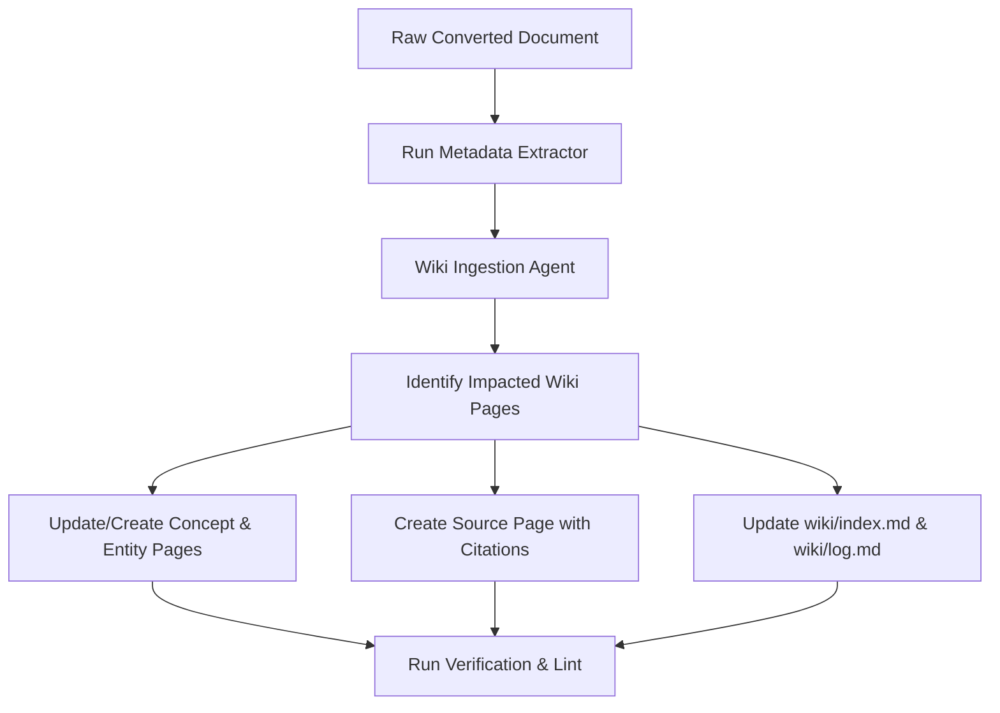

<!-- Copyright © 2026 Mustafa Uzumeri. All rights reserved. -->

# DECISION-006: LLM Wiki Integration for Compounding Domain Knowledge

> **Date:** 2026-06-07
> **Context:** Evaluation and design proposal for integrating Andrej Karpathy's "LLM Wiki" concept into the `CommonContext` curation pipeline. We analyze how introducing a persistent, LLM-maintained markdown wiki layer can resolve ingestion-order bias, reconcile cross-document contradictions at ingestion time, and optimize downstream vector retrieval.
> **Status:** Open — proposed for review and implementation planning.
> **Participants:** Mustafa Uzumeri, Antigravity Agent

---

## Table of Contents

1. [Executive Summary](#1-executive-summary)
2. [The Core Shift: Document-RAG vs. Compounding Wiki-RAG](#2-the-core-shift-document-rag-vs-compounding-wiki-rag)
3. [Evaluating the Article: Code vs. Markdown Agent](#3-evaluating-the-article-code-vs-markdown-agent)
4. [Wiki-Integrated Curation Architecture](#4-wiki-integrated-curation-architecture)
5. [Impact on Information Ingestion](#5-impact-on-information-ingestion)
6. [Impact on Metadata Extraction & Provenance](#6-impact-on-metadata-extraction--provenance)
7. [Mitigating Ingestion-Order Bias & Concurrency Risks](#7-mitigating-ingestion-order-bias--concurrency-risks)
8. [Implementation Plan](#8-implementation-plan)

---

## 1. Executive Summary

Traditional Retrieval-Augmented Generation (RAG) processes documents in isolation, splitting them into fragments, embedding them, and asking the LLM to synthesize knowledge on the fly for every user query. This model is computationally expensive, struggles with multi-hop reasoning, and defers the resolution of cross-document contradictions to query-time.

Andrej Karpathy's [LLM Wiki](https://gist.github.com/karpathy/442a6bf555914893e9891c11519de94f) pattern proposes a different paradigm: inserting an LLM-maintained, persistent, interlinked markdown wiki between the raw documents and the user. When a new document is added, an LLM agent integrates it into the wiki—updating concept summaries, linking related terms, and explicitly highlighting contradictions.

This document evaluates how to apply this pattern to [CommonContext](file:///Users/mustafauzumeri/Documents/GitHub/CommonContext) (the Knowledge Slot curation engine for the Cosolvent framework). We propose a **hybrid architecture** that uses `CommonContext`'s Python infrastructure for job control, metadata extraction, and vector pipeline tasks, while delegating the semantic synthesis, page compilation, and contradiction resolution to a structured Agentic Markdown Instruction set.

---

## 2. The Core Shift: Document-RAG vs. Compounding Wiki-RAG

The current `CommonContext` ingestion pipeline runs as a straight-through converter, utilizing [chunk_and_embed.py](file:///Users/mustafauzumeri/Documents/GitHub/CommonContext/chunk_and_embed.py):

```
Inputs (PDF/URL/Tabular) ──► outputs/*.md ──► chunk_and_embed.py ──► outputs/*.jsonl ──► Vector DB
```

In this model, if **GAFTA Contract No. 48** contains weighing rules that contradict **GAFTA Contract No. 27**, both are embedded. The retrieval engine is forced to resolve the discrepancy at query time, leading to inconsistent answers or high reasoning costs.

The **LLM Wiki** integration adds a persistent semantic layer between conversion and embedding:

```
               ┌────────────────────────────────────────────────────────┐
               │              LLM-Maintained Domain Wiki                │
               │                                                        │
Inputs ──► outputs/*.md ──► Ingest Agent ──► wiki/pages/ (Concepts/Roles) ──► chunk_and_embed.py ──► JSONL ──► DB
               │                    ▲           │ (Compounded, resolved)
               │                    └───────────┘
               │                     Lint Agent (contradiction audits)
               └────────────────────────────────────────────────────────┘
```

### Comparative Analysis

| Dimension | Current CommonContext Pipeline | Proposed LLM Wiki Integration |
| :--- | :--- | :--- |
| **Ingestion Target** | Independent, isolated raw files converted to markdown. | A single, interlinked, compiled domain wiki directory. |
| **Contradiction Resolution** | Deferred to Q&A query-time (expensive and error-prone). | Handled at ingestion time (LLM flags conflicts; curation sponsor reviews). |
| **Retrieval Context** | Raw text fragments from multiple, disconnected files. | Reconciled, semantic summary pages for specific concepts/entities. |
| **Multi-Hop Queries** | Poor; relies on vector search retrieving all relevant fragments. | Excellent; the LLM has pre-compiled connections and links. |
| **Sponsor Curation** | Sponsors review YAML schemas and flat markdown files. | Sponsors interact directly with a readable, git-tracked wiki. |

---

## 3. Evaluating the Article: Code vs. Markdown Agent

Leandro Bernardo's article (*[I Built Karpathy's LLM Wiki Twice — Once as Code, Once as a .md. Here's What Each One Gives Up](https://pub.towardsai.net/i-built-karpathys-llm-wiki-twice-once-as-code-once-as-a-md-heres-what-each-one-gives-up-08b31170999a)*) contrasts two implementation paths:

1. **The Programmatic Version (Python Package):** Built with strict Pydantic schemas, deterministic content-addressable IDs, and LangGraph repair agents. Best for scale, automation, repeatability, and large pipelines.
2. **The Agentic Version (.md / AGENTS.md):** A simple, instruction-driven system where a frontend agent (like Claude Code or Cursor) edits a flat directory based on conversational guidelines. Best for small-to-medium scale, fast iteration, and zero-infra personal setups.

### Recommendation for CommonContext: The Hybrid Approach

Because `CommonContext` is an offline curation tool that compiles authoritative data for downstream marketplace servers, a **purely conversational Markdown Agent is insufficient**. We require the audit trails, automation, and vector-pipeline integration of the programmatic approach.

However, a **purely programmatic model** is too rigid to handle the complex semantic task of reading a text contract and deciding how it alters an abstract concept page.

We recommend a **Hybrid Architecture**:
- **Programmatic Engine (Python):** Utilizes `CommonContext`'s existing Python infrastructure: [server.py](file:///Users/mustafauzumeri/Documents/GitHub/CommonContext/server.py) (API/GUI layers), [provenance.py](file:///Users/mustafauzumeri/Documents/GitHub/CommonContext/provenance.py) (provenance tracking), [metadata_extractor.py](file:///Users/mustafauzumeri/Documents/GitHub/CommonContext/metadata_extractor.py) (metadata imputation), and [chunk_and_embed.py](file:///Users/mustafauzumeri/Documents/GitHub/CommonContext/chunk_and_embed.py) (embedding & output generation).
- **Agentic Instruction (Markdown Prompts):** A dedicated, version-controlled system prompt template (`prompts/wiki_ingestion_agent.md`) that guides the LLM through the complex task of editing the wiki page structure, maintaining cross-links, and updating the global index.

---

## 4. Wiki-Integrated Curation Architecture

We propose introducing a new `wiki/` directory to store the state of the domain synthesis:

```
CommonContext/
├── inputs/                      # Immutable raw sources
├── outputs/                     # Clean markdown versions of inputs
├── wiki/                        # The LLM Wiki State
│   ├── raw_sources/             # Copy of output markdowns currently integrated
│   ├── pages/                   # Consolidated markdown pages
│   │   ├── concepts/            # e.g., weighing_rules.md, force_majeure.md
│   │   ├── entities/            # e.g., grain_grades.md, GAFTA_contract_rules.md
│   │   └── sources/             # e.g., source_GAFTA_27_2025.md (Metadata stubs)
│   ├── index.md                 # Content-oriented map (Concepts, Entities, Sources)
│   └── log.md                   # Chronological log of ingests and lints
```

---

## 5. Impact on Information Ingestion

The ingestion process evolves from a single-file compilation to a multi-file integration sequence managed by a new script `wiki_ingester.py` (exposed as `/api/wiki/ingest` in the GUI/API):



### Detailed Ingestion Steps

1. **Probe and Target:** The Ingestion Agent reads the new converted source and the existing `wiki/index.md`. It emits a JSON list of pages that need updating or creation.
2. **Interactive Edit:** For each target page, the agent receives the page's current content and the new source text. It updates the page, incorporating new details.
3. **Traceable Citations:** All claims in the updated wiki pages must carry explicit inline citations referencing the source page and line number range, e.g., `[[sources/GAFTA_27_2025#L45-L52|GAFTA 27, Clause 18]]`.
4. **Index & Log Update:** The agent appends a log entry to `wiki/log.md` (e.g., `## [2026-06-07] ingest | GAFTA 27 (2025 Edition)`) and updates the category trees in `wiki/index.md`.

---

## 6. Impact on Metadata Extraction & Provenance

The existing metadata extraction process ([metadata_extractor.py](file:///Users/mustafauzumeri/Documents/GitHub/CommonContext/metadata_extractor.py)) fits perfectly into the LLM Wiki pattern:

1. **Source Page Generation:** When [metadata_extractor.py](file:///Users/mustafauzumeri/Documents/GitHub/CommonContext/metadata_extractor.py) completes, its JSON output is used to generate a dedicated source index page in `wiki/pages/sources/<document_stem>.md`.
2. **Metadata Frontmatter:** The source page contains the extracted metadata as YAML frontmatter (organization, date, geographic scope, etc.), followed by a summary of the source and a checklist of wiki pages it updates.
3. **Downstream Traceability:** When downstream vector search retrieves a chunk from `wiki/pages/concepts/weighing_rules.md`, the chunk content includes the source link `[[sources/GAFTA_27_2025]]`. The QA LLM can resolve this link to retrieve the exact provenance records (URL, publisher, acquisition date) to present a citation-quality answer to the user.

---

## 7. Mitigating Ingestion-Order Bias & Concurrency Risks

Two primary challenges emerge when using an LLM to manage a markdown wiki:

### Challenge 1: Ingestion-Order Bias (Anchoring)
If documents are ingested sequentially, the LLM will anchor the wiki's taxonomy to the first document (e.g., GAFTA 27). Later documents (e.g., USDA standards) will be compressed into that layout rather than restructuring the wiki.

*   **Mitigation (Stateful Batch-Lint):** We implement a periodic `wiki_linter.py` script. The linter runs a multi-pass audit over the wiki directory. It takes a randomized subset of pages and scans for inconsistencies, duplicate pages, or opportunities to consolidate terms.
*   **Mitigation (Randomized Re-indexing):** For major updates, the sponsor can trigger a "Rebuild Wiki" command, which clears the wiki and re-ingests documents in a randomized order to ensure the compiled structure is unbiased.

### Challenge 2: Concurrency & Mutation Conflict
If an LLM modifies wiki pages while a human sponsor is editing them, file corruption or race conditions can occur.

*   **Mitigation (Git-as-Concurrency-Lock):** Because the wiki is a local directory of markdown files, we treat **Git as our transaction manager**. Before the LLM runs an ingestion job, it validates that the git working directory is clean. Each ingestion session runs on a temporary git branch (`wiki-ingest-<doc-id>`). Once complete, the LLM creates a diff. The curation sponsor can review the diff in the GUI or via standard git tools and merge it. This provides absolute concurrency control, safety, and a complete rollback history.

---

## 8. Implementation Plan

To integrate this model into `CommonContext` without breaking the existing pipeline, we recommend a phased approach:

### Phase 1: Wiki Directory & Ingestion Agent (Local CLI)
- Create the `wiki/` directory structure.
- Add `prompts/wiki_ingestion_agent.md` outlining the edit instructions, citation format rules, and markdown standards.
- Implement `wiki_ingester.py` containing:
  - `select_impacted_pages(source_text, wiki_index) -> list[str]`
  - `integrate_source_into_page(source_text, page_path) -> new_content`
  - `update_index_and_log(document_metadata)`
- Verify locally by ingesting `outputs/27_2025.md`.

### Phase 2: Web GUI & Git Branching
- Update [server.py](file:///Users/mustafauzumeri/Documents/GitHub/CommonContext/server.py) to expose `/api/wiki/ingest` and `/api/wiki/diff`.
- Integrate git automation: create branch on ingest start, commit changes to branch, expose diff in GUI, and merge on sponsor approval.
- Add a "Wiki" view to the SPA frontend to browse pages, follow links, and see the edit log.

### Phase 3: Chunking & Database Integration
- Update [chunk_and_embed.py](file:///Users/mustafauzumeri/Documents/GitHub/CommonContext/chunk_and_embed.py) to support a `--wiki` mode.
- In wiki mode, the script chunks `wiki/pages/concepts/` and `wiki/pages/entities/` instead of raw converted outputs.
- Because these pages are clean, structured markdown written by the LLM, the heading-based chunker will produce highly coherent vector embeddings with pre-resolved cross-document context.

---

## 9. Manual Bootstrapping Guidelines (Minimizing Backtracking)

If you wish to start drafting and organizing the domain wiki manually (e.g., inside Obsidian or a markdown editor) before the programmatic integration is complete, adhering to these rules will ensure zero backtracking and maximum compatibility with future programmatic updates:

### 9.1 Folder and Slug Structure Invariant
*   Keep the wiki nested under a `wiki/` directory at the root of `CommonContext/`.
*   Maintain the split:
    *   `wiki/pages/concepts/` (for concept synthesis, e.g., `weighing_rules.md`)
    *   `wiki/pages/entities/` (for domain-specific entities/roles, e.g., `superintendent.md`)
    *   `wiki/pages/sources/` (for document index pages, e.g., `source_27_2025.md`)
*   **Filename Slug Rule:** All filenames must be `lower_snake_case` (e.g., `force_majeure.md`, NOT `Force Majeure.md` or `Force-Majeure.md`). This enables deterministic programmatic link-checks and schema mappings.

### 9.2 Strict YAML Frontmatter Metadata
Always prepend clean YAML frontmatter containing metadata aligned with the schemas folder.
*   **For concepts and entities:**
    ```yaml
    ---
    title: "Weighing Rules"
    type: "concept" # or "entity"
    topics: [weighing, quality]
    last_updated: 2026-06-07
    sources: [GAFTA_27_2025]
    ---
    ```
*   **For source summary pages:**
    ```yaml
    ---
    title: "GAFTA Contract No. 27 (2025 Edition)"
    type: "source"
    issuing_organization: "GAFTA"
    document_type: "contract"
    date_published: 2025
    jurisdiction: ["Canada", "US"]
    ---
    ```

### 9.3 Bidirectional Wiki-Links Format
*   Use standard wikilink syntax pointing to page paths without leading or relative components: `[[concepts/weighing_rules]]` or `[[sources/source_27_2025]]`.
*   To refer to specific clauses or anchors, append hash tags: `[[sources/source_27_2025#clause_18|GAFTA 27, Clause 18]]`.

### 9.4 Structuring Headings for Heading-Based Chunking
Because the pipeline chunks by heading hierarchy via [chunk_and_embed.py](file:///Users/mustafauzumeri/Documents/GitHub/CommonContext/chunk_and_embed.py):
*   Use exactly **one H1 (`#`)** at the top of the file for the page title.
*   Use **H2 (`##`)** for high-level concepts (e.g., `## GAFTA 27 Weighing Provisions`).
*   Use **H3 (`###`)** for clause details.
*   Keep text blocks under each heading under ~500 words to ensure optimal chunk embedding length.

### 9.5 Git-Managed Concurrency
*   Commit your manual drafts to Git regularly.
*   When the programmatic ingester is later turned on, it will fetch updates in isolated git branches (e.g., `wiki-ingest-<doc-id>`), making it trivial to diff, merge, and resolve conflicts with manual entries.

### 9.6 Index and Log Maintenance
*   Append ingests to `wiki/log.md` manually: `## [YYYY-MM-DD] manual | Created force_majeure page`.
*   Keep `wiki/index.md` updated with lists of pages grouped by type.

---

> [!NOTE]
> Integrating the LLM Wiki pattern changes the Knowledge Slot curation from an "ingest-once-and-forget" RAG setup to a continuous, compounding domain-knowledge synthesis. While it adds a processing step, it substantially reduces LLM reasoning costs during live marketplace operations and guarantees higher citation accuracy.

