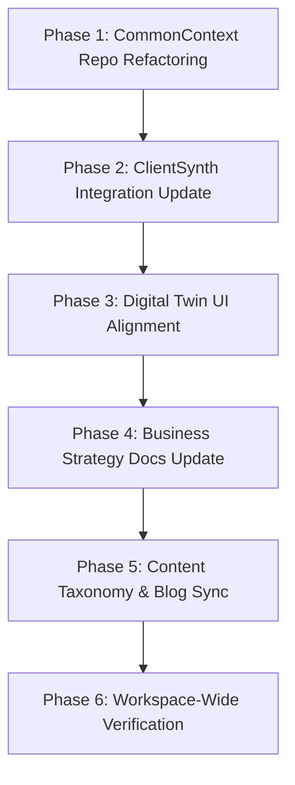

<!-- Copyright © 2026 Mustafa Uzumeri. All rights reserved. -->

# ROADMAP: Renaming & Aligning "KnowledgeSlot" to "CommonContext"

This roadmap details the systematic transition from **KnowledgeSlot** (passive/offline curation tool concept) to **CommonContext** (active, multi-vertical transactional domain grounding framework) across all DeeperPoint codebases, configuration files, and website pages.

---

## Executive Summary

The DeeperPoint platform has evolved. What was originally conceived as the **KnowledgeSlot** — a passive, sponsor-curated reference library — has matured into the **CommonContext** framework. This framework acts as a dynamic domain-grounding engine that resolves information asymmetries, captures real-time "pull signals" (gaps) from live transactions, and populates vertical-specific ontologies.

To ensure consistency in documentation, codebase integration, client-facing demonstrations, and content taxonomy, we are systematically renaming and purging all legacy references to `knowledgeslot` (and its variants) and replacing them with `CommonContext`.

---

## The Core Challenge

We have performed a comprehensive workspace scan across the 12 active workspaces. The legacy terms appear in five primary contexts:
1. **`CommonContext` (formerly `KnowledgeSlot`)**: The renamed repository itself contains deep structural references, prompt files, and design decision records (`docs/DECISION-*`).
2. **`ClientSynth`**: Hardcoded integration strings mapping schema imports back to the curation tool.
3. **`marketforge_digital_twin`**: The interactive visual mockup application has hardcoded component states, toggle switches (`KnowledgeSlot default`), logging primitives, and data matrices.
4. **`DeeperPointBlogging`**: Staged draft and published blog articles (such as *The Broken Skidder* and *Irish Trad Thin Market*) and LinkedIn teasers that conceptualize the "Knowledge Slot."
5. **`DeeperpointBusiness`**: High-level business blueprints, syllabi, and codebase reviews.

---

## Phased Action Plan



---

### Phase 1: CommonContext (Curation Repo) Refactoring
*Objective: Clean up all legacy self-references inside the newly renamed repository.*

#### 1. Documentation & General Files
Update references in the following primary files:
- **[FEATURES.md](file:///Users/mustafauzumeri/Documents/GitHub/CommonContext/FEATURES.md)** (Lines 3, 135)
  - Change `# KnowledgeSlot — Product Feature Sheet` to `# CommonContext — Product Feature Sheet`.
  - Update descriptions of curation tooling from `KnowledgeSlot` to `CommonContext`.
- **[README.md](file:///Users/mustafauzumeri/Documents/GitHub/CommonContext/README.md)** (Line 19)
  - Change directory stub `AIKnowledgeSlotCuration/` to `CommonContext/`.
- **[ROADMAP.md](file:///Users/mustafauzumeri/Documents/GitHub/CommonContext/ROADMAP.md)** (Lines 3, 38, 101)
  - Change `# AIKnowledgeSlotCuration Roadmap` to `# CommonContext Roadmap`.
  - Update the descriptive table entries.

#### 2. Code Files & Prompts
- **[chunk_and_embed.py](file:///Users/mustafauzumeri/Documents/GitHub/CommonContext/chunk_and_embed.py)** (Line 6)
  - Update the file header and docstring: `Processes CommonContext Markdown...`
- **[prompts/alternative_compliance_extraction.md](file:///Users/mustafauzumeri/Documents/GitHub/CommonContext/prompts/alternative_compliance_extraction.md)** (Line 5)
  - Update `KnowledgeSlot automated discovery pipeline` to `CommonContext automated discovery pipeline`.

#### 3. Architecture & Design Decision Records (`docs/`)
We must systematically rewrite the headers and references inside the architecture documents to maintain alignment with the new naming scheme:
- **[docs/DECISION-000-architecture-and-integration.md](file:///Users/mustafauzumeri/Documents/GitHub/CommonContext/docs/DECISION-000-architecture-and-integration.md)**
  - Rename the file/header: `DECISION-000: Architecture and Integration (CommonContext ↔ Cosolvent)`
  - Update all tables mapping `B1 — Knowledge Slot` to `B1 — CommonContext`.
- **[docs/DECISION-001-pull-signal-transport.md](file:///Users/mustafauzumeri/Documents/GitHub/CommonContext/docs/DECISION-001-pull-signal-transport.md)**
  - Rename header: `Design Decision: Pull Signal Transport Between Cosolvent and CommonContext`
  - Update data-flow diagrams: `Cosolvent ──POST /api/gap-signal──→ CommonContext API`
- **[docs/DECISION-002-staleness-detection.md](file:///Users/mustafauzumeri/Documents/GitHub/CommonContext/docs/DECISION-002-staleness-detection.md)**
  - Update references to periodic scanning of the `CommonContext` library.
- **[docs/DECISION-003-facilitator-subtypes.md](file:///Users/mustafauzumeri/Documents/GitHub/CommonContext/docs/DECISION-003-facilitator-subtypes.md)**
- **[docs/DECISION-004-reference-table-design.md](file:///Users/mustafauzumeri/Documents/GitHub/CommonContext/docs/DECISION-004-reference-table-design.md)**
  - Update standard tables. E.g., `knowledge_gap_signals` → `common_context_gap_signals` (or `gap_signals`).
- **[docs/DECISION-005-chunking-and-tagging-pipeline.md](file:///Users/mustafauzumeri/Documents/GitHub/CommonContext/docs/DECISION-005-chunking-and-tagging-pipeline.md)**
- **[docs/ANALYSIS-006-alternative-channel-discovery.md](file:///Users/mustafauzumeri/Documents/GitHub/CommonContext/docs/ANALYSIS-006-alternative-channel-discovery.md)**

---

### Phase 2: ClientSynth Integration Sync
*Objective: Update ClientSynth's importing routes that target the legacy repository.*

In the `ClientSynth` repository, there is an explicit, hardcoded API route that labels the schema's import source as `AIKnowledgeSlotCuration`. This must be updated to ensure schema provenance is tracked under the correct project name:
- **[app/api/v1/schemas/import/route.ts](file:///Users/mustafauzumeri/Documents/GitHub/ClientSynth/app/api/v1/schemas/import/route.ts)** (Line 73)
  ```diff
  - source: "AIKnowledgeSlotCuration"
  + source: "CommonContext"
  ```

---

### Phase 3: Digital Twin & Interactive Demos
*Objective: Rebrand the visual twin UI to ensure client presentations show "CommonContext."*

The `marketforge_digital_twin` repository contains extensive UI strings and state properties that reference `KnowledgeSlot`. This is a high-priority front-end refactoring task because these strings are displayed in interactive client mockups.

#### 1. React Components & Mock Interfaces
- **[app.jsx](file:///Users/mustafauzumeri/Documents/GitHub/Marketforge_digital_twin/app.jsx)**
  - Line 72: Change `<span>KnowledgeSlot default</span>` to `<span>CommonContext default</span>`.
  - Line 98: Change `{ key:'knowledge', label:'KNOWLEDGESLOT', count: 2 }` to `{ key:'knowledge', label:'COMMONCONTEXT', count: 2 }`.
  - Line 220: Change `{ title: 'KnowledgeSlot editor' }` to `{ title: 'CommonContext editor' }`.
- **[primitives.jsx](file:///Users/mustafauzumeri/Documents/GitHub/Marketforge_digital_twin/primitives.jsx)**
  - Line 162: Update `KnowledgeSlot · {item.field}` to `CommonContext · {item.field}`.
- **[pre-app.jsx](file:///Users/mustafauzumeri/Documents/GitHub/Marketforge_digital_twin/pre-app.jsx)**
  - Line 167: Change `['KnowledgeSlot','v2.1', 'Grounds domain ontology; closes data gaps and lifts match confidence.']` to `['CommonContext','v3.0', 'Grounds domain ontology; closes data gaps and lifts match confidence.']`.
- **[shell.jsx](file:///Users/mustafauzumeri/Documents/GitHub/Marketforge_digital_twin/shell.jsx)**
  - Line 25: Change `label: 'KnowledgeSlot'` to `label: 'CommonContext'`.
  - Line 220: Change `title: 'KnowledgeSlot applied'` to `title: 'CommonContext applied'`.
- **[screens-1-2.jsx](file:///Users/mustafauzumeri/Documents/GitHub/Marketforge_digital_twin/screens-1-2.jsx)** (Line 133) and **[screens-3-4.jsx](file:///Users/mustafauzumeri/Documents/GitHub/Marketforge_digital_twin/screens-3-4.jsx)** (Line 110)
  - Change text/badges from `KnowledgeSlot` to `CommonContext`.
- **[screens-5.jsx](file:///Users/mustafauzumeri/Documents/GitHub/Marketforge_digital_twin/screens-5.jsx)**
  - Line 113: Update warning: `◆ CommonContext is holding this signal open...`
  - Line 117: Update table rows: `◆ CommonContext enhanced signal · contributes to confidence`.
  - Line 198: Update footer status panel label to `CommonContext`.

#### 2. Mock Databases & Log Feeds
- **[screen-addons.jsx](file:///Users/mustafauzumeri/Documents/GitHub/Marketforge_digital_twin/screen-addons.jsx)**
  - Line 22: Update audit log string: `'Applied CommonContext to "Surface finish" (high impact)'`.
  - Line 146: Change key `'knowledgeslot'` to `'commoncontext'`.
  - Line 230: Change step label to `'CommonContext'`.
- **[data.jsx](file:///Users/mustafauzumeri/Documents/GitHub/Marketforge_digital_twin/data.jsx)**
  - Lines 96, 106, 116: Change `note: 'KnowledgeSlot prompt active'` to `note: 'CommonContext prompt active'`.
  - Change `ksNote` entries to explain that `CommonContext` (not `KnowledgeSlot`) revealed the capabilities.
  - Lines 128, 129, 137, 145: Update the score categories comments to read `// CommonContext` instead of `// KnowledgeSlot`.

---

### Phase 4: Business Strategy & Analysis Documents
*Objective: Maintain conceptual alignment in historical review documents.*

In the `DeeperpointBusiness` repository, update the comprehensive reviews and learning roadmaps:
- **[Analysis/2026-05-21-codebase-relationship-review.md](file:///Users/mustafauzumeri/Documents/GitHub/DeeperpointBusiness/Analysis/2026-05-21-codebase-relationship-review.md)**
  - Update title to: `Codebase Relationship Review: Cosolvent, CommonContext, and MarketForge Digital Twin`
  - Update sections B and comparative tables mapping the responsibilities of `CommonContext` vs. `Cosolvent`.
- **[Analysis/2026-05-21-agentic-ai-learning-plan.md](file:///Users/mustafauzumeri/Documents/GitHub/DeeperpointBusiness/Analysis/2026-05-21-agentic-ai-learning-plan.md)** (Lines 9, 47, 147)
  - Change syllabus description mapping `KnowledgeSlot` to `CommonContext`.
  - Update the file link to point to [CommonContext/seed_reference_library.py](file:///Users/mustafauzumeri/Documents/GitHub/CommonContext/seed_reference_library.py).

---

### Phase 5: Content Taxonomy & Blog Sync (DeeperPointBlogging)
*Objective: Bring the marketing and newsletter channels in line with the new taxonomy rules.*

The blog post tagging rules (`DeeperPointBlogging/GEMINI.md`) have already adopted `commoncontext` as a core topic tag. However, numerous drafts and published articles use the term "Knowledge Slot" conceptually.

#### 1. Terminology Policy
Going forward, the following terminology rules should apply:
- **YAML Taxonomy Tag**: Use `commoncontext` in the `tags: [...]` list (already added in the Blogging brief).
- **Drafts and Future Articles**: Avoid "Knowledge Slot" or "KnowledgeSlot" in new drafts. Refer to the domain-grounding library as the **CommonContext layer** or **CommonContext**.
- **Historical/Published Articles**: Retroactively renaming published files is not recommended, as it can break external links (e.g. `irish-trad-thin-market.html`). However, internal text references to the platform feature should be updated to **CommonContext (formerly referred to as the Knowledge Slot)** or **CommonContext** where possible, or kept as a conceptual synonym.

#### 2. Blogging Plan Refactoring
- **[ShadowCapacity-18-Post-Plan.md](file:///Users/mustafauzumeri/Documents/GitHub/DeeperPointBlogging/ShadowCapacity-18-Post-Plan.md)** (Line 69)
  - Align the description of post 15 to reference "CommonContext" as primary, keeping the parenthetical "Knowledge Slot" as a historical transition.

---

## Terminology Guidelines

To prevent future nomenclature drift, use this vocabulary mapping:

| Old / Legacy Term | New / Target Term | Context | Example |
| :--- | :--- | :--- | :--- |
| `KnowledgeSlot` / `knowledgeslot` | `CommonContext` / `commoncontext` | Repository, variable, config key | `import { CommonContext } from '...'` |
| `AIKnowledgeSlotCuration` | `CommonContext` | Curation repository mapping | `source: "CommonContext"` |
| `Knowledge Slot` (space) | `CommonContext` or `CommonContext layer` | Blog posts, conceptual descriptions | "The platform's CommonContext layer..." |
| `knowledge_gap_signals` | `common_context_gap_signals` / `gap_signals` | Database table names | `SELECT * FROM gap_signals` |

---

## Validation & Verification Plan

After executing the edits outlined above, the following steps must be completed to ensure validation:

### 1. Workspace-Wide Search
Run a global search command to ensure no lingering `knowledgeslot` references remain in active code paths:
```bash
# From GitHub workspace root
rg -i "knowledgeslot"
```
*(Expected output: Only historical, explicitly excluded markdown blog posts or git-history objects should return results.)*

### 2. Frontend Twin Verification
In the `marketforge_digital_twin` repository, spin up the local development instance to verify that the UI components render the "CommonContext" labels properly and the state toggles function correctly:
```bash
cd Marketforge_digital_twin
npm run dev
```
- Navigate to the evaluation dashboards.
- Verify the toggle label reads **"CommonContext default"**.
- Check that the mock event logger shows `'Applied CommonContext to "Surface finish"'`.

### 3. API Import Testing
Verify that `ClientSynth` can still pull schemas by launching its development server and performing a mock schema synchronization:
```bash
cd ClientSynth
npm run dev
```
- Trigger a mock schema import and verify the payload contains the source `'CommonContext'`.

---

<!--Copyright (c) 2026 Mustafa Uzumeri. All rights reserved.-->
